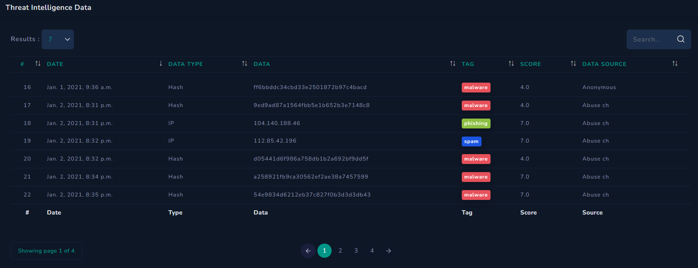

# Threat Intelligence Feed

A SOC team should be immediately aware of the latest threats and take the necessary precautions. To meet this need, threat intelligence feeds are created. As a SOC analyst, you can use these feeds to guide your investigations.

## What is a Threat Intelligence Feed?

A Threat Intelligence Feed is data (such as malware hashes, C2 (Command & Control) domain/IP addresses, etc.) provided by a third-party company.

Looking at LetsDefend's Threat Intel page, you can see many types of data (hash, IP, etc.)

## Purpose of Threat Intelligence Feeds

The data here consists of artifacts from previous malicious activity. It could be the hash of malware or the IP address of a command and control center. As a SOC analyst, you need to search threat intelligence feeds to determine if a hash file at hand has ever been used in a malicious scenario in the past.

## Popular Threat Intelligence Sources

Here are some free and popular sources you can use:

- [VirusTotal](https://www.virustotal.com)
- [Talos Intelligence](https://talosintelligence.com)

## Important Points to Highlight

### If Data You Run Through Feeds Does Not Show Up

Let's say you ran a hash of an `.exe` in VirusTotal and you didn't find anything suspicious about it. In this case, you should not just assume that the file is clean; that would be a mistake. A SOC analyst should carefully perform the necessary file analysis (static/dynamic).

### IP Addresses Can Change Hands

For example, let's say an attacker created a server on AWS (Amazon Web Services) and used it as a command and control center. Then various threat intelligence feeds listed that IP address as a malicious address.

Two months later, the attacker shut down the server, and someone else moved their personal blog to that server. This doesn't mean that people who visited the blog were exposed to malicious content. The fact that this IP address has been used for malicious purposes in the past does not mean that it contains malicious content now.

## Conclusion

Threat intelligence feeds are essential tools for SOC analysts to stay informed about the latest threats and malicious activities. By utilizing these feeds effectively, SOC teams can enhance their investigative capabilities and improve overall security posture.

**Search IP/Hash in threat intelligence feed here:**

