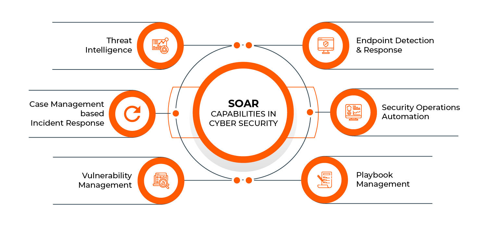
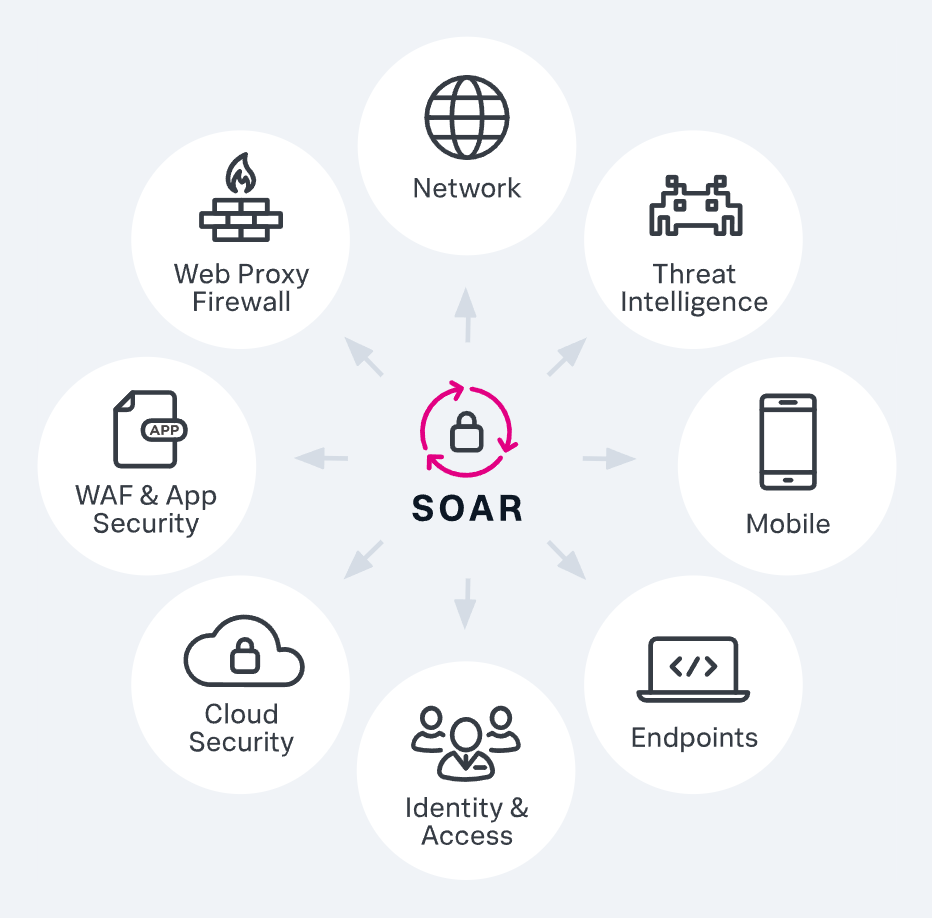

# SOAR (Security Orchestration Automation and Response)

SOAR stands for Security Orchestration Automation and Response. It enables security products and tools in an environment to work together, streamlining the tasks of SOC team members. For example, it will automatically search VirusTotal for the source IP of a SIEM alert, reducing the workload of the SOC analyst.

## Common SOAR Products

- Splunk Phantom
- IBM Resilient
- Logsign
- Demisto

The image below shows what can be achieved with a SOAR solution.

## Benefits of SOAR

### Saves You Time

SOAR saves time with workflows that automate processes. Some common workflows are:

- IP address reputation control
- Hash query
- Scanning an acquired file in a sandbox environment
- ...

### Centralization (A Single Platform for Everything You Need)

It allows you to use different security tools in your environment (sandbox, log management, 3rd party tools, etc.) by providing an all-in-one software. These tools are integrated into the SOAR solution and can be used on the same platform.

### Playbooks

You can easily investigate SIEM alerts using playbooks created for different scenarios within SOAR. Even if you don't know or remember all the procedures, you can perform an analysis by following the steps outlined in the playbooks.

In addition, these playbooks help ensure that the entire SOC team is on the same page when performing their analysis. For example, all team members need to check IP reputation, so if one team member is not checking it and the others are, this is an undesirable situation. We can avoid this situation by adding this step to the playbook.

## LetsDefend and SOAR

You can think of "Case Management" as the same as SOAR. On the SIEM (monitoring) page, you can open tickets for the cases you created. When you look at the page, the first thing you see is a list of open and closed cases.

If you click on any open case, you will see an automatically assigned playbook. You can investigate the associated SIEM (monitoring) alert following this playbook.

## Conclusion

So far, we have covered what a SOAR solution is, how it is used in a SOC environment, and how it benefits SOC analysts in general. In the next lesson, we will explore threat intelligence and how it relates to a SOC analyst.

**Case Management/SOAR Quick Tour:**
